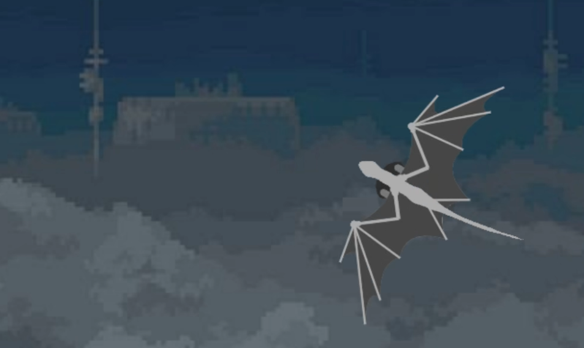
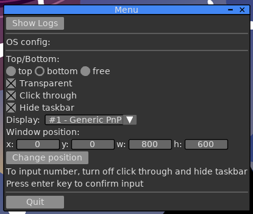

# 蜥蜴桌宠

[更新日志](./CHANGELOG.md)

使用 [LÖVE](https://love2d.org/) 游戏引擎编写的桌宠，使用了动态生成的动画，用 FABRIK 反向动力学算法模拟龙的骨架运动，并根据骨架绘制出样貌。比起常见的用贴图的桌宠更灵动，比 live2d 实现的人物动物角色更灵活，但是没有那么好看。

项目的契机：<https://scratch.mit.edu/projects/687027232>
参考：
- <https://twitter.com/TheRujiK>
- <https://github.com/lincerely/gecko>

[展示视频](https://www.bilibili.com/video/BV1Ei421Z75n)

## 运行方式

Windows x86-64 位可以下载 Release 中构建好的版本。

其他系统运行请先下载对应系统的 LÖVE，再下载 Release 中扩展名为 .love 的文件，使用 LÖVE 打开该文件即可。其他系统可能不支持透明窗口等功能，如果有能力也可以帮忙移植。

也可以直接 clone 本项目，或下载 zip 压缩档，使用 LÖVE 运行。

## 操作

目前，飞龙只会跟随鼠标运动，随后会添加更多行为方式。

按 <kbd>Ctrl</kbd> + <kbd>Alt</kbd> + 鼠标右键打开菜单，菜单中各个选项和功能分别为：

- **Show Logs**: 显示运行日志
- **OS config**: 系统相关配置
  - **Top/Bottom**: 切换窗口置顶/置底/自由
  - **Transparent/Click through/Hide taskbar**: 分别为使窗口透明、鼠标点击穿透、隐藏任务栏图标
  - **Display**: 切换显示器
  - **Window position**: 设置窗口的位置和大小，按 `Change position` 按钮应用设置。如果需要横跨多显示器，可以在此调整，先选择基准的显示器，再按你的显示器排列方式，调整窗口大小
- **Quit**: 退出程序

启用鼠标点击穿透时，不能向输入框中输入，需要先把点击穿透和隐藏任务栏图标关闭，才能输入。点击穿透关闭后，可以直接按右键打开菜单。

如果要排查错误或向作者报告错误，可以在 `AppData/Roaming/LOVE` 目录中找到日志文件。日志也会输出到控制台，如果要打开控制台显示，可以解包游戏以后在 `conf.lua` 中修改 `t.console = false` 为 `t.console = true`。

## 构建

构建脚本为 build.sh，使用 bash 运行 在 Windows 下，推荐使用 MSYS2 bash 环境，或者 Git Bash，或者 WSL，反正构建脚本也很简单。目前只能生成 Windows x86-64 版本。

构建会在 build 目录下生成 Windows 系统的可执行文件和依赖。

构建需要设置环境变量：

VERSION: 版本
LOVE_DIR: LÖVE 主程序所在的目录
